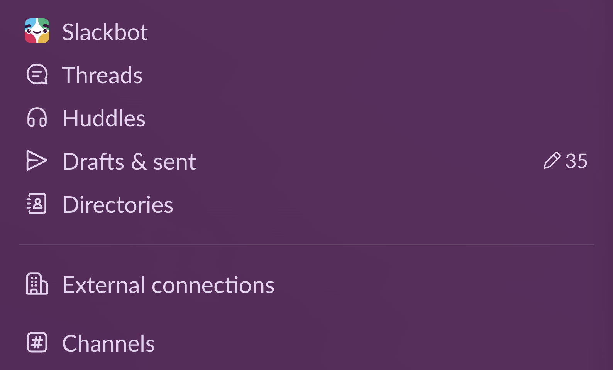
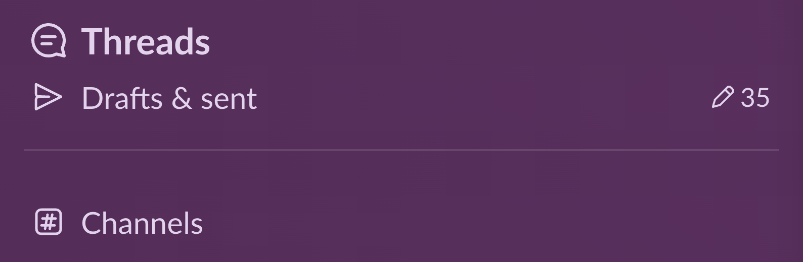

# slack-debloat

De-bloat the **native** Slack app on macOS with your own CSS and JS — like uBlock Origin + Tampermonkey, but for the desktop app.

Slack's macOS app is Electron, i.e. a Chromium rendering the same web app as your browser — you just normally can't put extensions in it. slack-debloat launches Slack with its Chrome DevTools Protocol port open (localhost-only) and runs a tiny zero-dependency injector that pushes your `custom.css` / `custom.js` into every Slack window, keeps them across reloads, and **live-reapplies within a second whenever you save**. Hide the Activity tab, the huddle button, Slackbot, upsell banners — whatever annoys you.

| Before | After |
|:--|:--|
|  |  |

Hidden rows collapse for real (no blank slots — see auto-reflow below), and you can restyle what stays: here Threads got promoted to 18px semibold.

## How it works

```
Slack Debloat.app (Dock icon)          LaunchAgent (login)
        │                                     │
        └─ launches Slack with                └─ inject.mjs polls localhost:9222,
           --remote-debugging-port=9222          attaches to every Slack window via CDP,
           (localhost only)                      injects custom.css + custom.js,
                                                 re-injects on every file save
```

No patching of Slack.app (it's code-signed; modifying it breaks Gatekeeper and Keychain). Slack updates itself normally.

## Requirements

- macOS, Slack desktop app in `/Applications`
- Node.js ≥ 22 (uses the built-in WebSocket client — no npm dependencies)

## Install

```bash
git clone https://github.com/benri-ai/slack-debloat.git
cd slack-debloat
./install.sh
```

Then launch Slack via the new **Slack Debloat** app (it wears Slack's own icon) and put it in your Dock in place of Slack. That's it.

The installer:
1. seeds `config.json` / `custom.css` / `custom.js` from the `.example` files (your copies are gitignored),
2. installs a LaunchAgent that keeps the injector running from login,
3. builds `/Applications/Slack Debloat.app`.

**Try it without installing anything:** `./slack-debloat.sh` relaunches Slack with the debug port and runs the injector in your terminal (Ctrl-C to stop; Slack keeps running).

A thin green line at the very top of the Slack window confirms injection is working (remove it in `custom.css` once you trust the setup).

## Usage

### config.json — the built-in options

`config.json` (seeded from `config.json.example` on install) is a flat map of option keys to booleans. Flip a key to `true`, save, and the running Slack updates within a second — no restart, no rebuild. It's plain JSON on purpose: edit it by hand, or point your LLM at this README and let it do the flipping.

```json
{
  "hide-slackbot-dm": true,
  "hide-upsell-banners": true,
  "bigger-threads-row": true
}
```

(Keys you omit default to off; unknown keys are ignored with a warning in `injector.log`.)

| key | what it does |
|---|---|
| `hide-slackbot-dm` | Slackbot DM row in the sidebar |
| `hide-threads-row` | Threads row in the sidebar |
| `hide-huddles-row` | Huddles row in the sidebar |
| `hide-drafts-row` | Drafts & sent row in the sidebar |
| `hide-directory-row` | Directory row in the sidebar |
| `hide-slack-connect-row` | External connections (Slack Connect) header in the sidebar |
| `hide-activity-tab` | Activity tab in the left rail (hides its badge too) |
| `hide-later-tab` | Later tab in the left rail |
| `hide-files-tab` | Files tab in the left rail |
| `hide-tools-tab` | Tools tab in the left rail |
| `hide-huddle-button` | Huddle button in the channel header |
| `hide-slackbot-ai-button` | Slackbot AI button next to the search bar |
| `hide-upsell-banners` | In-channel "megaphone" promo banners (Business+ trials etc.) |
| `bigger-threads-row` | Make the Threads sidebar row larger (18px semibold, bigger icon) |

The selectors behind these keys live in `catalog.mjs`, verified on Slack 4.50. Slack updates occasionally rename them; fixes are usually a two-minute DevTools job (see below) — PRs welcome.

### custom.css / custom.js — everything else

**Hide things by hand:** for anything not in the catalog, edit `custom.css`, save — same ~1s live apply. The `.example` file ships with commented-out rules showing the patterns.

**Find selectors:** while Slack runs debloated, open **http://localhost:9222** in Chrome and you get full DevTools against the native app. Prefer Slack's `[data-qa=...]` attributes — they're much more stable than the generated class names. Sidebar rows are virtualized, so hide the whole row wrapper:

```css
[data-qa="virtual-list-item"]:has([data-qa^="channel_sidebar_pslackbot"]) {
  display: none !important;
}
```

Rows hidden this way don't leave blank slots: the injector ships an auto-reflow shim that detects hidden virtual-list rows and shifts the remaining rows up, re-applying whenever Slack re-renders. The sidebar collapses cleanly, as if the items never existed.

**Run scripts:** `custom.js` runs in every Slack window on load and on every save (write idempotent code).

**Poke at the DOM from a terminal:**

```bash
node eval.mjs 'document.title'
node screenshot.mjs slack.png                        # full window
node screenshot.mjs sidebar.png '.p-channel_sidebar' # clipped to a selector
```

## FAQ

**What if I open the regular Slack app?**
You get stock Slack (no debug port), and the injector just idles. Clicking Slack Debloat quits and relaunches it with the port. Note that if Slack's own "Launch app on login" setting is on, it starts stock at every boot — turn it off and click the wrapper instead.

**Does this survive Slack updates?**
The mechanism, yes. Individual CSS selectors may need a tweak when Slack renames things — that's the DevTools-at-localhost:9222 workflow.

**Do huddles / calls / notifications still work?**
Yes — it's the unmodified Slack app; nothing is patched or proxied.

**Security note:** the DevTools port is bound to localhost only, but while Slack runs this way, any *local* process could attach to it and read your Slack session. Fine on a personal machine; know the trade-off.

**Uninstall:** `./uninstall.sh`, then quit and reopen Slack normally.

## Disclaimer

Not affiliated with or endorsed by Slack/Salesforce. Cosmetic use at your own risk.

## License

MIT
